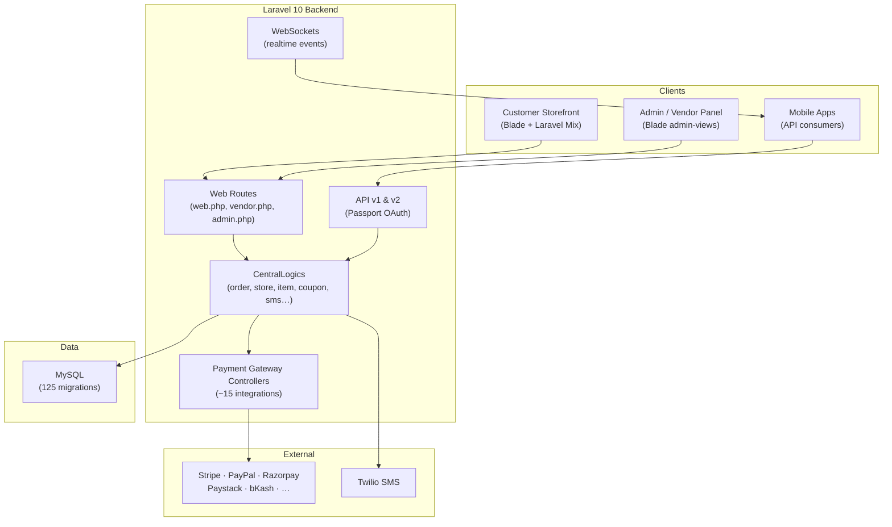

<p align="center"></p>

<p align="center">


</p>

> **Developed by [Arslan Malik](https://github.com/arsalanmaalik461)**
> 📱 WhatsApp: [+92 300 8987448](https://wa.me/923008987448) · 🌐 Website: [arslanmalik.tech](https://arslanmalik.tech)

---

## 🌟 Executive Overview

This is a **multi-vendor delivery platform** built on Laravel 10 — the kind of system that powers food ordering, grocery delivery and parcel services from a single codebase. Stores register and manage their own catalogs (items, add-ons, attributes, categories), customers order through the storefront, and a fleet of delivery men fulfills orders with live tracking, while administrators orchestrate everything from a Blade-based admin panel: zones, modules, banners, campaigns, coupons, commissions, wallets and employee roles.

The architecture is **modular and zone-driven**. A `Module` / `Zone` system lets the business enable different service types per region — the code shows food-store concepts (`Item`, `AddOn`, `Campaign`), parcel delivery (`ParcelCategory`, `ParcelDeliveryInstruction`) and a delivery-man fleet (`DeliveryMan`, `DMVehicle`, `TrackDeliveryman`, `ProvideDMEarning`) all coexisting. Business logic is centralized in `app/CentralLogics` (order, store, item, coupon, banner, customer, sms) so the web, API v1 and API v2 layers share one source of truth.

Payments are a standout: around **fifteen gateway integrations** are wired in — Stripe, PayPal, Razorpay, Paystack, Paymob, Paytabs, SslCommerz, bKash, Flutterwave, MercadoPago, Xendit, LiqPay, SenangPay, Paytm and more — plus wallet payments, Twilio SMS notifications, Laravel WebSockets for realtime updates, and a guided installer (`installation/`) that ships with a database seed and public assets for deployment.

---

## 📑 Table of Contents

- [✨ Key Features & Highlights](#-key-features--highlights)
- [🖥️ Feature Showcase](#️-feature-showcase)
- [🏗️ System Architecture](#️-system-architecture)
- [🚀 Quickstart & Installation Guide](#-quickstart--installation-guide)
- [📂 Project Structure](#-project-structure)
- [🛡️ Security & Notes](#️-security--notes)

---

## ✨ Key Features & Highlights

| Feature | Description |
| :--- | :--- |
| 🧩 Modular multi-vendor engine | `Module` + `Zone` system enables food / grocery / parcel services per region (`modules_statuses.json`, `ModuleController`) |
| 🏪 Store management | Vendor onboarding, store config, schedules, self-delivery settings via `vendor.php` routes and `CentralLogics/store.php` |
| 🍔 Catalog system | Items with add-ons, attributes, categories, units, item tags, translations and common conditions |
| 🧾 Order lifecycle | Cart → checkout → order, with `OrderDeliveryHistory`, cancellation/refund flows and `CentralLogics/order.php` as the single source of truth |
| 🛵 Delivery-man fleet | `DeliveryMan` model with vehicle types (`DMVehicle`), live tracking (`TrackDeliveryman`), reviews (`DMReview`), wallets and earning reports |
| 📦 Parcel delivery | Parcel categories and delivery instructions for courier-style bookings |
| 💳 ~15 payment gateways | Stripe, PayPal, Razorpay, Paystack, Paymob, Paytabs, SslCommerz, bKash, Flutterwave, MercadoPago, Xendit, LiqPay, SenangPay, Paytm — plus wallet payments |
| 📲 SMS notifications | Twilio SDK with a modular `sms_module.php` gateway abstraction (`SmsGateway` trait) |
| 🔔 Realtime updates | `beyondcode/laravel-websockets` for live order and tracking events |
| 🎟️ Marketing suite | Campaigns, promotional banners, coupons, wallet bonuses, testimonials, flash-style common conditions |
| 👥 Roles & employees | Custom admin roles and employee management (`AdminRole`, `CustomRoleController`) |
| 🌍 Multi-language | `Translation` model, locale routes (`lang/{locale}`), multilingual storefront content |
| 🧰 Guided installer | `installation/` ships `database.sql`, `public.zip` and install/update route activators for server deployment |
| 🔌 API v1 & v2 | Versioned REST APIs (`routes/api/v1`, `routes/api/v2`) for mobile apps, with Laravel Passport OAuth |
| 📊 Exports | Fast-Excel and mPDF based reports and data exports |

---

## 🖥️ Feature Showcase

### 1. Modular Multi-Vendor Engine

> *"One platform, many businesses — zones decide which services run where."*

- Zones group service areas; modules (food, grocery, parcel…) toggle on per zone
- Store self-registration (`dm-registration.blade.php`, vendor routes) with admin approval flows
- Business settings, currencies, taxes and commissions managed centrally
- `CentralLogics` keeps order/store/item logic identical across web, API v1 and API v2

### 2. Order & Delivery-Man Pipeline

> *"From cart to doorstep with every handoff tracked."*

- Cart, checkout-complete and cancellation/refund storefront pages
- Delivery-man assignment with live tracking (`TrackDeliveryman`) and delivery history
- DM earnings (`ProvideDMEarning`), wallets, vehicle management and reviews
- Parcel category system for non-food courier bookings

### 3. Payment Gateway Arsenal

> *"If a customer can pay with it, there's probably a controller for it."*

- Dedicated web controllers per gateway: Stripe, PayPal, Razorpay, Paystack, Paymob, Paytabs, SslCommerz, bKash, Flutterwave, MercadoPago, Xendit, LiqPay, SenangPay, Paytm
- Wallet payments with bonus support (`WalletBonusController`)
- Account transactions ledger (`AccountTransaction`) for admin finance

### 4. Installer & Admin Control

> *"Deployable without a DevOps team — seed database, unzip assets, follow the wizard."*

- `installation/` provides `database.sql`, `public.zip` and install/update route scripts
- Admin panel covers banners, coupons, notifications, zones, employees, DM management and settings
- Contact messages, terms/privacy/refund CMS pages and email templates included

---

## 🏗️ System Architecture



---

## 🚀 Quickstart & Installation Guide

Requires **PHP ^7.3|^8.1**, **Composer**, **Node.js**, **MySQL**.

```bash
# 1. Clone and install dependencies
git clone https://github.com/arsalanmaalik461/123.git
cd 123
composer install
npm install

# 2. Environment
cp .env.example .env
php artisan key:generate
# → edit .env: DB_*, APP_URL, mail, Twilio, gateway keys

# 3. Database — use the installer seed or migrate fresh
# Option A (seeded demo data):
mysql -u root -p your_db < installation/database.sql
# Option B (fresh schema):
php artisan migrate

# 4. Public assets
php artisan storage:link
npm run production   # Laravel Mix build

# 5. Serve
php artisan serve
# queue worker for notifications/jobs:
php artisan queue:work
```

> ℹ️ The `installation/` folder also contains `public.zip` and install/update route activators intended for a guided server deployment. Configure at least one payment gateway and the Twilio SMS credentials in `.env` before accepting live orders.

---

## 📂 Project Structure

```
123/
├── app/
│   ├── CentralLogics/      # Shared business logic: order, store, item, coupon, banner, customer, sms…
│   ├── Http/Controllers/
│   │   ├── Admin/          # Banner, Coupon, DeliveryMan, Employee, Item, Module, Zone…
│   │   ├── *PaymentController.php  # Stripe, PayPal, Razorpay, Paystack, bKash, …
│   │   └── Api/            # V1 / V2 mobile APIs
│   ├── Models/             # Store, Item, Order, DeliveryMan, Coupon, Campaign, Zone…
│   └── Traits/             # SmsGateway and shared traits
├── routes/                 # web.php, admin/, api/v1, api/v2, vendor.php, install.php, update.php
├── resources/views/        # Blade storefront + admin-views
├── database/migrations/    # 125 migrations
├── installation/           # database.sql, public.zip, install/update route scripts
├── modules_statuses.json   # nwidart module toggles (Gateways)
├── Modules/  public/  storage/  tests/
└── composer.json  package.json (Laravel Mix)  webpack.mix.js
```

---

## 🛡️ Security & Notes

- **Secrets:** keep `.env` (DB, gateway keys, Twilio, Passport keys) out of version control — never commit it.
- **Payments:** each gateway controller handles its own callback — verify signatures/statuses server-side before marking orders paid; test in sandbox mode first.
- **Installer:** the `installation/database.sql` seed may contain demo credentials — change all admin passwords immediately after deploying.
- **WebSockets:** `beyondcode/laravel-websockets` needs its own port/process in production (supervisor recommended).
- **Uploads:** store/item images go through `storage` — keep the symlink in place and validate uploads.

---

<p align="center">
<strong>Multi-Vendor Delivery Platform</strong> — developed with ❤️ by <a href="https://github.com/arsalanmaalik461">Arslan Malik</a><br>
📱 <a href="https://wa.me/923008987448">+92 300 8987448</a> · 🌐 <a href="https://arslanmalik.tech">arslanmalik.tech</a>
</p>
